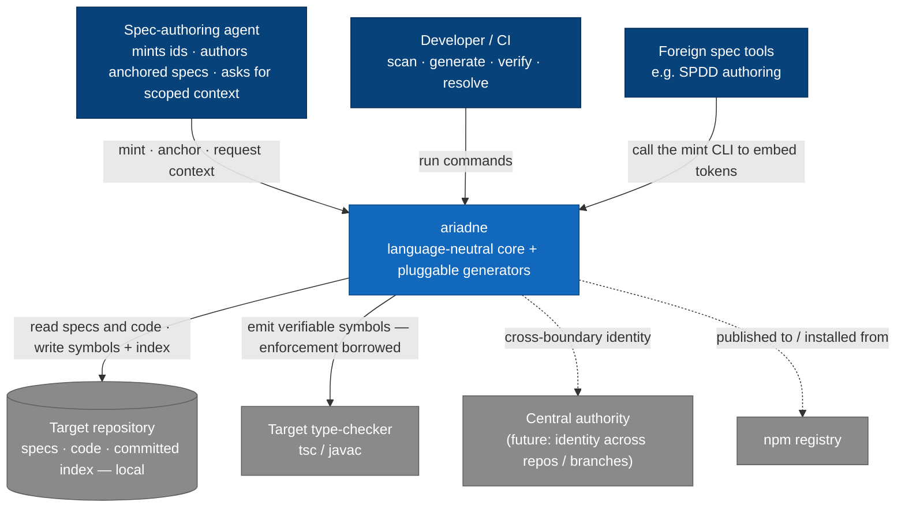
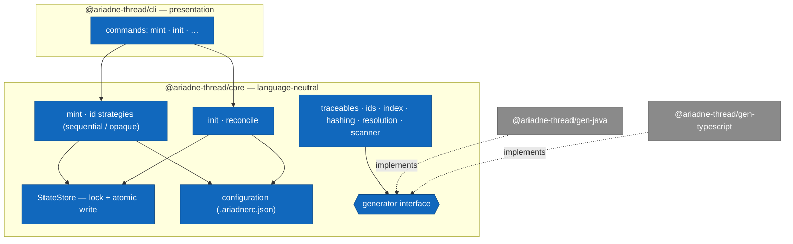

# Architecture and constraints

This document is the framing for the CLI.
It is narrative.
This document explains the shape.
The atomic, anchored architecture rules and constraints are authored as ARCH and CON specs when the architecture they constrain is built; those specs are what the code is checked against.

## Shape

The tool is a language-neutral core with pluggable, language-specific generators.

The core deals only in traceables, ids, the index, content hashes, and resolution.
None of this knows a target language.

A generator turns the set of traceable ids into verifiable symbols in one target language and defines how code references a symbol.
Generators sit behind a narrow interface.
Java and TypeScript are the first two.

The core depends on the generator interface, never on a concrete generator.
This boundary is the one that must not erode.

## Enforcement, in three layers

The core anchors ids language-neutrally.
A language-specific generator materializes them as verifiable symbols.
Existence is enforced by the target language's type-checker where one exists, and by a dedicated build check otherwise.

## Code organization

Domain entity types — the ENT elements of the domain model — live together in one module per package, `core/src/entities`, mirroring `domain-model.md`.
Behaviour that operates on them (the store, services) lives in its own module and imports the entity types.
This gives each domain entity one place in the code and a clear counterpart to anchor, and keeps behaviour separate from the shapes it works on.

## Runtime

The scanner, generators, resolver, and CLI run on Node and ship via npm.
The tool only writes text; it runs no language runtime of its own.

## Locality

The tool runs fully locally when the spec lives in the repo.
A central authority is needed only when identity must be guaranteed across a boundary a per-repo file cannot cover, such as parallel branches with heavy minting or multiple repos against one source.

## Views

These diagrams are views, not the source of truth.
The ARCH and CON specs and the ADRs are what the code is checked against; anchor against them, never against a diagram.
They follow the C4 model's context (C1) and component (C3) levels.
The container level (C2) is omitted — the tool is a single local CLI today; it earns a diagram once the central authority becomes a second running piece.
The code level (C4) is left to the type-checker, which is the truth the tool already borrows.

### Context (C1)

How the tool sits between the people who drive it and the systems it touches.
The defining relationship is that enforcement is *borrowed* from the target language's type-checker rather than reimplemented (ADR-0001 D1, D5).

### Components (C3)

Inside the tool: the CLI is presentation only and delegates to the language-neutral core, which reaches every generator through the generator interface and never through a concrete generator.
That boundary is the one that must not erode (ADR-0001 D9).

