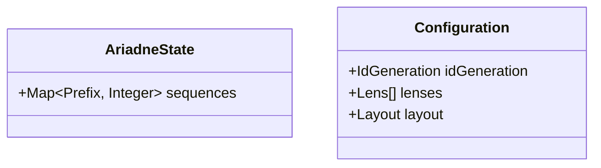

# Domain model

The canonical entities are the id-bearing list below.
Each entity states its purpose and lists its attributes with their types.
The Mermaid diagram is a view of the same entities; anchor code against the entity ids, never against the diagram.
Each entity's code type is anchored to its id, so a change to the spec shape or the code shape is flagged.

## Entities

### ENT-001 AriadneState

The tool's persistent, version-controlled state for a project.
It is the committed record the tool keeps across invocations and shares with the team through git, analogous to a Terraform state file.
Its shape grows only by adding new sections; existing sections are never changed in place.

**Attributes**

| Attribute | Type | Description |
| --- | --- | --- |
| `sequences` | `Map<Prefix, Integer>` | The highest number already allocated for each id prefix. A prefix absent from the map has allocated nothing yet. |

`Prefix` is a `String` id prefix (for example `STR`, `STK`) matching the configured id pattern.

### ENT-002 Configuration

The tool's per-project self-description, read from `.ariadnerc.json` at the project root.
It declares how ids are formed, the lenses the project uses, and where each kind of artifact lives.
It is version-controlled and shared with the team through git, alongside the state.
Its shape grows only by adding attributes or sections; existing ones are never changed in place.
Every attribute has a documented default, so a missing file or attribute is equivalent to that default (SW-009).
The defaults are the opinionated template (ADR-0001 D8); a project overrides only what differs.

An id is `<prefix>-<number>`, where the number is zero-padded to `idGeneration.padding` and the prefix is a configured one — a `lenses[].id` for a derived spec, or `layout.stories.prefix` / `layout.entities.prefix`.
The set of configured prefixes is the single source of truth for id validity, so no separate id pattern is configured (ADR-0003 subsumes the former `idToken.pattern`).

**Attributes**

| Attribute | Type | Description |
| --- | --- | --- |
| `idGeneration.mode` | `"sequential" \| "opaque"` | The id-generation scheme (ARCH-001). Defaults to `sequential`. |
| `idGeneration.padding` | `Integer` | Width to which sequential id numbers are zero-padded (CON-003). Defaults to `3`. |
| `lenses` | `List<{ id: String, description: String }>` | The derived-spec kinds (the `Lens` field) and the valid spec prefixes (ADR-0003). Each carries a one-line human definition. Defaults to `STK, SYS, SW, ARCH, NF, CON`. |
| `layout.stories` | `{ dir: String, prefix: String }` | Where stories live and their id prefix. Defaults to `{ "docs/spec/stories", "STR" }`. |
| `layout.derivedSpecs` | `{ dir: String }` | Where derived specs live; their prefixes are the `lenses` ids. Defaults to `docs/spec/derived-specs`. |
| `layout.entities` | `{ file: String, prefix: String }` | The domain-model file and the entity prefix. Defaults to `{ "docs/spec/domain-model.md", "ENT" }`. |
| `layout.drafts` | `{ dir: String }` | Where unapproved drafts live (mirrors the spec tree). Defaults to `docs/spec/drafts`. |
| `layout.state` | `{ file: String }` | The StateStore file (CON-001). Defaults to `.ariadne/state.json`. |

## View

