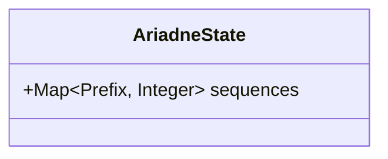

# Domain model

The canonical entities are the id-bearing list below.
Each entity states its purpose and lists its attributes with their types.
The Mermaid diagram is a view of the same entities; anchor code against the entity ids, never against the diagram.
Each entity's code type is anchored to its id, so a change to the spec shape or the code shape is flagged.

## Entities

### ENT-001 AriadneState

The tool's persistent, version-controlled state for a project.
It is the committed record the tool keeps across invocations and shares with the team through git, analogous to a Terraform state file.
Its shape grows only by adding new sections; existing sections are never changed in place.

**Attributes**

| Attribute | Type | Description |
| --- | --- | --- |
| `sequences` | `Map<Prefix, Integer>` | The highest number already allocated for each id prefix. A prefix absent from the map has allocated nothing yet. |

`Prefix` is a `String` id prefix (for example `STR`, `STK`) matching the configured id pattern.

## View

