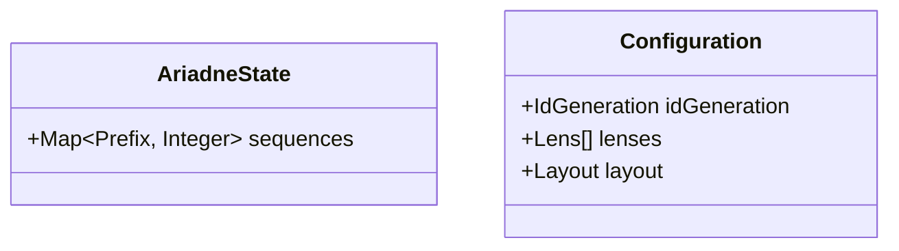

# Domain model

The entities clew owns, as an overview.
Each entity is specified in its own file under the derived-specs location, where its shape is pinned and its code type is anchored to its id.
This page is a non-normative view — like `architecture.md`, it carries no bound id of its own — that names the entities and shows how they relate.

## Entities

### ENT-001 AriadneState

The tool's persistent, version-controlled state for a project.
Specified in [ENT-001 — AriadneState](derived-specs/ENT-001-ariadne-state.md).

### ENT-002 Configuration

The tool's per-project self-description, read from `.ariadnerc.json`.
Specified in [ENT-002 — Configuration](derived-specs/ENT-002-configuration.md).

## View

